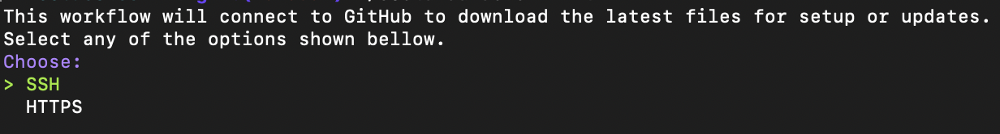
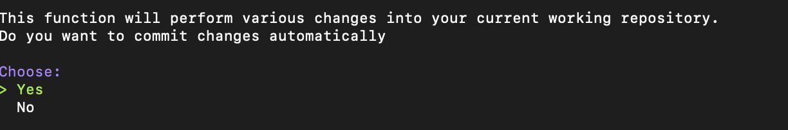
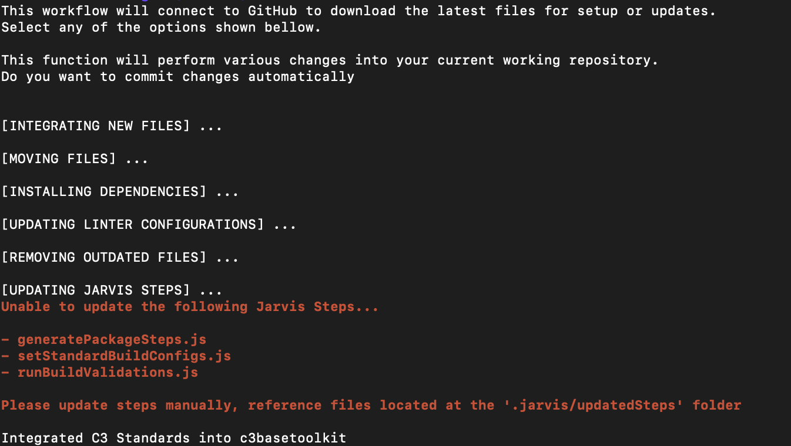
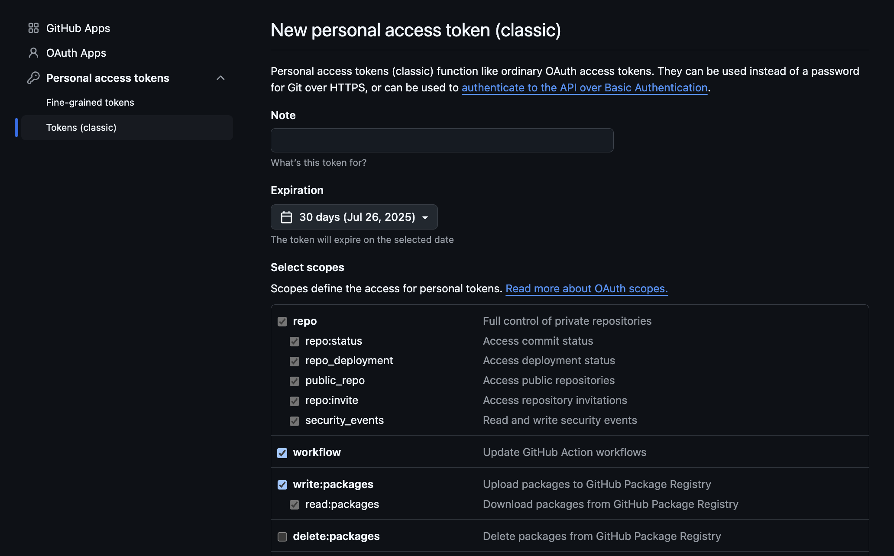
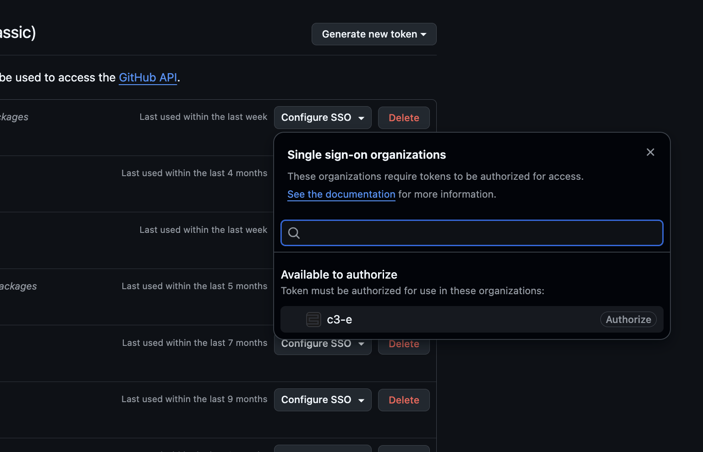
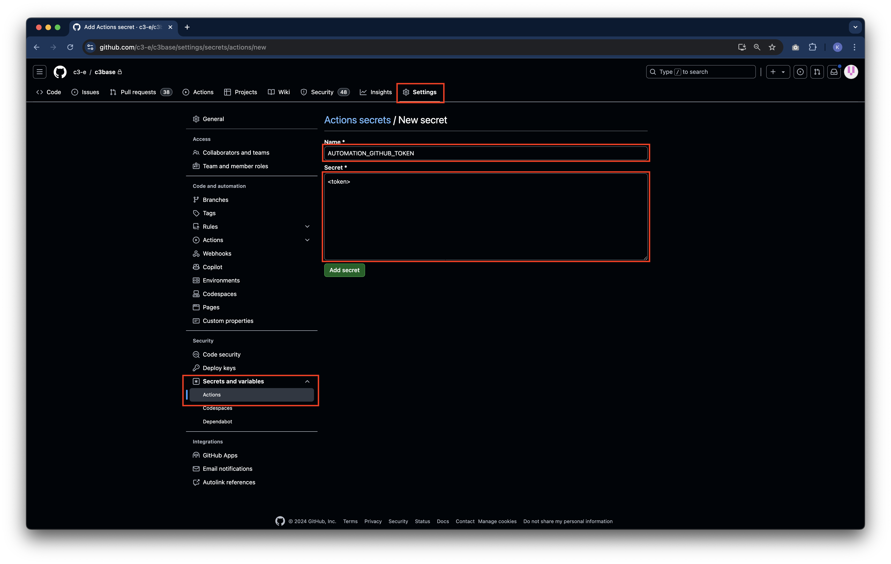
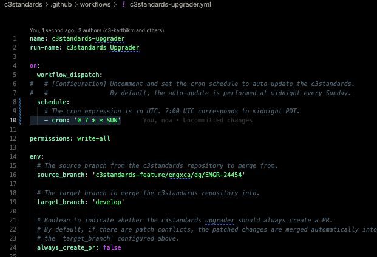

# C3 STANDARDS

This document serves as the main entry point for anything `c3standards` related.

Below is a list of all the commands for `c3standards`. All of them serve different purposes that will be described
throughout this document.

<table>
  <thead>
    <tr>
      <th scope="col">Category</th>
      <th scope="col">Command</th>
      <th scope="col">Description</th>
    </tr>
  </thead>
  <tbody>
    <tr>
      <th scope="row" rowspan="3">Version Management</th>
      <td><code>./c3standards version-dependency &lt;package&gt; &lt;version&gt; &lt;path&gt;</code></td>
      <td>Updates semantic version of the defined dependency in all packages under the given path</td>
    </tr>
    <tr>
      <td><code>./c3standards version-validate &lt;path&gt;</code></td>
      <td>Validates the semantic version of all packages at the specified path</td>
    </tr>
    <tr>
      <td><code>./c3standards version-update &lt;version&gt; &lt;path&gt;</code></td>
      <td>Sets the specified semantic version component for packages and dependencies</td>
    </tr>
    <tr>
      <th scope="row" rowspan="2">Setup</th>
      <td><code>./c3standards setup</code></td>
      <td>Installs the required setup tools</td>
    </tr>
    <tr>
      <td><code>./c3standards install</code></td>
      <td>Install the pre-commit hook</td>
    </tr>
    <tr>
      <th scope="row">Initialization</th>
      <td><code>./c3standards init</code></td>
      <td>Provide all c3standards commands and folders for version 8.9 and above (ONLY USED FOR INTEGRATIG `8.9+` STANDARDS FROM A 8.8 REPOSITORY)</td>
    </tr>
    <tr>
      <th scope="row">Update</th>
      <td><code>./c3standards update</code></td>
      <td>If repository points to support/v8.10, updates local files to latest commit on support/v8.10</td>
    </tr>
  </tbody>
</table>

## Table of Contents

- [What's c3standards?](#whats-c3standards)
- [Installing c3standards into your repository](#installing-c3standards-into-your-repository)
  - [Check the requirements](#0-check-the-requirements)
  - [Get the c3standards executable](#1-get-the-c3standards-executable)
  - [Integrate c3standards into your repository](#2-integrate-c3standards-into-your-repository)
    - [Integrate New and Updated Jarvis Steps](#25-integrate-new-and-updated-jarvis-steps)
  - [Install local development tools](#3-install-local-development-tools)
  - [Commit and push your changes](#4-commit-and-push-your-changes)
  - [Enable Code Analyzer in Jarvis](#5-enable-code-analyzer-in-jarvis)
  - [Configure GitHub Actions policy checks](#6-configure-github-actions-policy-checks)
- [Updating c3standards](#updating-c3standards)
- [Frequently Asked Questions](#frequently-asked-questions)
  - [Generate a Personal Access Token](#generate-a-personal-access-token)
  - [The `init` command.](#the-init-command)
  - [The `update` command](#the-update-command)
  - [`update` vs `init`](#update-vs-init)
  - [Auto upgrader](#auto-upgrader)
  - [Repository best practices](#repository-best-practices)
  - [Semantic Version Manager](#semantic-version-manager)
    - [`version-update`](#version-update)
    - [`version-bump`](#version-bump)
    - [`version-dependency`](#version-dependency)
    - [`version-validate`](#version-validate)
  - [c3standards Commands](#c3standards-commands)
- [Troubleshooting](#troubleshooting)
  - [Auto fixing linting issues](#auto-fixing-linting-issues)
  - [Linting](#linting)
    - [ECMAScript](#ecmascript-linting)
    - [Python](#python-linting)
    - [Prose](#prose-linting)

## What's c3standards?

The `c3standards` repository serves as a centralized hub to distribute setup scripts, linting configurations, auto
formatters, pre-commit hooks, and custom Jarvis steps to enforce coding standards across all c3 repositories.

The linting rules follow the coding standards set in the
[`c3guidelines`](https://github.com/c3-e/c3guidelines/blob/master/README.md) repository.

The custom Jarvis steps are in covered in more detail in the [`.jarvis/steps` README](.jarvis/README.md).

## Installing c3standards into your repository

> [!IMPORTANT]
>
> `c3-e/c3standards` is a template repository that must integrate into your team's repository (example `c3base`). Please
> ensure you run all scripts here in your Git repository and not in `c3standards`.

If you are currently working on a repository that doesn't have any of the `c3standards` features, you must perform the
following steps:

### 0. Check the requirements

To perform a successful integration of `c3standards` into your repository, these steps assume the following:

- A Personal Access Token (PAT) from GitHub
- An established communication protocol for GitHub (SSH/HTTPs)
- A local clone of your working repository

#### Relevant topics

[How do I get my Personal Access Token?](#generate-a-personal-access-token)

### 1. Get the c3standards executable

Run the following command at the root of your cloned repository:

```sh
curl -H "Authorization: token <PUT_YOUR_PAT_HERE>" \
  -L \
  -o c3standards.sh \
  https://raw.githubusercontent.com/c3-e/c3standards/support/v8.10/c3standards.sh;
  chmod +x c3standards.sh
```

See [What's the c3standards.sh file?](#c3standards-commands)

### 2. Integrate c3standards into your repository (ONLY FOR REPOS WITH v8.8- of server)

> [!WARNING]
>
> Please be aware that the `init` command is supposed to only run **once**. This is because this process modifies the
> repositories in a way that running it twice would throw errors.
>
> Additionally, if you are updating your repository for server versions `8.10` and up, it's not necessary to run `./c3standards.sh init` again, since 8.9+ standards and up is already been installed.
>
> Please be mindful of this!

Run the following `c3standards` command at the **root** of you repository.

```sh
./c3standards.sh init
```

The workflow begins with two questions. The first asks you to specify your preferred communication protocol for
integrating the changes introduced in 8.9. Please choose the protocol that best aligns with your current method of
retrieving content from GitHub.



Next, you'll be asked whether you'd like to automatically commit changes at the end of the process. If you'd prefer to
review each individual change before committing, select no. Otherwise, choose yes to commit everything automatically.



After that, you will see a couple of output messages on the console. Bellow you will see an example of the `init`
command running on `c3basetoolkit`.



#### 2.5 Integrate New and Updated Jarvis Steps

When you run `init` on the working repository, you'll likely encounter an error message at the end of the execution,
similar to the one shown in the previous example.

The 8.10 `c3standards` not only attempts to update existing steps but also introduces two new ones:
`setStandardsBuildConfig` and `runBuildValidations`. These new steps, along with any existing steps that failed to
integrate, will be placed in a newly generated folder called `updatedSteps` within the `.jarvis` directory.

It's essential to integrate setStandardsBuildConfig and runBuildValidations into your Jarvis pipeline, as they're
critical to the build process. If the workflow is unable to update certain steps due to customizations that differ from
the default steps provided by `c3standards`, you'll see a list of steps in the console that couldn't be integrated into
your `.jarvis/steps` folder. As shown in the screenshot above, the process may fail to integrate the two new steps and
existing ones like `generatePackageSteps`. Here is how you can integrate these new/modified steps:

- To add `setStandardsBuildConfig` and `runBuildValidations`, simply move these steps into your `.jarvis/steps` folder.
- For `generatePackageSteps`, which already exists from previous versions of `c3standards`, review the updated version
  in the `.jarvis/updatedSteps` folder and merge any customizations you’ve made. Ensure that your customized changes are
  fully incorporated and place the step in the `.jarvis/steps` folder.
- After you have moved the new steps into your `.jarvis/steps` folder and updated existing steps with the necessary
  changes, you can safely remove the `.jarvis/updatedSteps` folder.

Once you’ve completed this process, your repository will be fully updated with all the new features and improvements
from 8.9 `c3standards`.

#### Relevant topics

[What's the init command?](#the-init-command)

### 3. Install local development tools

Once the `init` workflow has ben finished, please close your terminal session, and open a new one.

When you `cd` to your repository's directory, enter the following:

```sh
direnv allow
```

This allows `direnv` to manage your development environment for your repository. After that, run

```sh
./c3standards.sh install
```

You can execute this command regularly to keep all tools up to date. During installation, you'll be prompted to enter
your user password to grant super user permissions for certain tasks.

When you see the following prompt:

`Do you want to use a custom, self-managed conda environment? Select (no) to automatically setup. (yes/no)`

- Enter **`no`** to have the script automatically setup conda and an environment for you.
- Enter **`yes`** if you prefer to manage your own conda installation _(Note: The ENG-X team will not provide support
  for issues related to custom conda setups.)_
  - Ensure you already have conda installed and available in your PATH variable.
  - Ensure you have activated a conda environment that can run Python 3.9 or later.

### 4. Commit and push your changes

Once all the previous steps have been finished, you can create a commit to save all the repository modifications.

The commit can be either pushed directly to its remote branch, or can be saved on a different branch to create a PR for
further review.

### 5. Enable Code Analyzer in Jarvis

The final step in the integration workflow is to enable continuous monitoring of the health of the repository by
enabling the C3 AI Code Analyzer in C3 AI Release Management. The C3 AI Code Analyzer will perform static code analysis
on your code changes and provide automated code reviews on your pull requests.

Set the "Path to repository configuration files" on your registered branch groups to `.jarvis/steps` to enable the C3 AI
Code Analyzer.

<!-- vale Vale.Terms = NO -->


<!-- vale Vale.Terms = YES -->

### 6. Configure GitHub Actions policy checks

`c3standards` includes GitHub Actions workflows that publish **commit status** contexts you can require in
GitHub branch protection rules.

#### PR checks gate (`c3standards/pr-checks`)

The workflow at `.github/workflows/c3standards-pr-checks.yml` publishes a single `c3standards/pr-checks` commit status that aggregates:

- Jarvis (`continuous-integration/jarvis*`)
- C3 AI Code Analyzer (`C3 AI Code Analyzer*`)
- P0/P1 policy (`policy/p0p1`)

This lets you require **one** status check in branch protection instead of three.

**Setup**

- Add `c3standards/pr-checks` as a required status check for your protected branches (**recommended single required check**).
  - Note: GitHub only shows a status check in branch protection after it has been published at least once. Create a PR to
    one of your protected branches first if it doesn't appear in the dropdown.
- If your Jarvis / Code Analyzer status context names differ, update the prefixes in `.github/workflows/c3standards-pr-checks.yml`.

#### Jira P0/P1 Bug validation (`policy/p0p1`)

The workflow at `.github/workflows/c3standards-policy-p0p1.yml` (and its implementation script
`.github/scripts/c3standards-policy-p0p1-jira.js`)
enforces that PRs targeting `master`, `release`, `release/vX.Y`, or `support/vX.Y`:

- Have a Jira key in the PR title (for example, `PPTY-1234`)
- Reference a Jira issue of type **Bug**
- Have a priority in the allowed list (default: `P0 - Blocker` or `P1 - Urgent with no workaround`)

It publishes a commit status with context `policy/p0p1` (used by `c3standards/pr-checks`).

**One-time setup**

1. Create a Jira API token

   1. Log in to your Jira instance
   2. Go to Account Settings → Security → API tokens
   3. Select "Create API token"
   4. Give it a descriptive label (for example, "GitHub Actions - <repo-name>")
   5. Copy the generated token

2. Add repository secrets

   Go to _Settings → Secrets and variables → Actions_ and add:

   | Secret Name      | Description                               | Example                          |
   | ---------------- | ----------------------------------------- | -------------------------------- |
   | `JIRA_BASE_URL`  | Your Jira instance base address           | `https://c3energy.atlassian.net` |
   | `JIRA_EMAIL`     | Email address for Jira API authentication | `your-email@c3.ai`               |
   | `JIRA_API_TOKEN` | Jira API token for authentication         | `ATATT3x...`                     |

3. Configure branch protection

   Protect the branch patterns you care about and require **`c3standards/pr-checks`**. This aggregates Jarvis + Code Analysis +
   P0/P1 into a single required check.

**Customization**

- Allowed priorities: update `ALLOWED_PRIORITIES` in `.github/workflows/c3standards-policy-p0p1.yml`.
- Target branches: update the "Determine whether policy applies (target branch)" step in `.github/workflows/c3standards-policy-p0p1.yml`.

**Troubleshooting**

- "Jira credentials missing": ensure the three secrets exist and the Jira user can read the relevant projects.
- "couldn't find Jira issue": confirm the key in the PR title and Jira access permissions.
- "Issue isn't a Bug" / "Priority not allowed": update the Jira ticket or adjust allowed priorities.

## Updating c3standards

> [!IMPORTANT]
>
> `c3-e/c3standards` is a template repository that must integrate into your team's repository (example `c3base`). Please
> ensure you run all scripts here in your Git repository and not in `c3standards`.

Updating the `c3standards` framework is a straightforward process that can be accomplished with a single command.

```sh
./c3standards.sh update
```

This ensures that your environment remains aligned with the latest improvements, configurations, and best practices with
minimal effort.

#### Relevant topics

[What's the update command?](#the-update-command)

## Frequently Asked Questions

### Generate a Personal Access Token

To generate your own personal access token, you must do the following:

- On GitHub, select your profile and select `Settings`
- At the lower end of the menu at the right, select `Developer Settings`
- Select `Personal access tokens` and then select `Tokens (classic)`
- You will be redirected to this screen: 
  - Select `repo`, `workflow`, `read:packages` and `write:packages`. If setting an expiration date for the token, please
    make sure to refresh the token frequently.
- Select `Generate token`
  - Save the token in a safe and accessible location.
- Authorize the `c3-e` organization for using this token.
  - 
- Go to _`Settings` → `(Security) Secrets and variables` → `Actions`_ and create a new **repository secret** called
  `AUTOMATION_GITHUB_TOKEN`.\
  

### The `init` command

#### Who is this for?

- Any new hire who's cloned a C3 repository to their local machine
- C3 repositories migrating from `8.8` to `8.9`

To promote consistency, simplify updates, and reduce merge conflicts across downstream repositories, all core
configuration files and setup scripts have been centralized within the `c3standards` directory. This new structure will
be the new template for server versions `8.9+` and the centralized folder will contain every feature that's shipped with
`c3standards`

This centralization applies to tools such as:

- Linter configuration files
- Shell setup and automation scripts

```
c3standards/
├── config/               # Folder dedicated for storing base configurations and extensions for
│   └── .eslintrc.base.js
│   └── .prettierrc.base.js
│   └── ...
├── scripts/              # Folder containing automation scripts for pre commit hooks and semantic version managing.
│   └── c3standards-upgrader/
│   └── hooks/
│   └── ...
└── setup/                # Folder with code to install development tools
    └── playbooks/
    └── roles/
    └── ...
```

The `init` command was made with the intention of easing the process of transforming an `8.8` or lower version
repository into a `8.9` compatible one, while still maintaining functionality and any linter overrides set by the
developers.

```sh
./c3standards.sh init
```

After the command finishes execution, the current working repository will now have created/modified the following files:

<!-- vale Vale.Terms = NO -->
<!-- vale C3.FieldLink = NO -->

- STANDARDS.md
- .github/
- c3standards/
- .eslintrc.js
- .prettierrc.js
- .stylelintrc.js
- package.json
- .pre-commit-config.yaml

And the following files will be **deleted** (if you have them):

- scripts/
- setup/
- .eslintrc
- .prettierrc
- .stylelintrc,
- LICENSE
- Makefile
- OLD_LICENSE

<!-- vale Vale.Terms = YES -->
<!-- vale C3.FieldLink = YES -->

At the beginning of the `init` workflow, you will receive three input prompts:

- Communication Protocol Selection
  - Both the `init` and the `update` commands require fetching information from GitHub. When running the `init` command,
    you'll be prompted to select your preferred communication protocol.
- Custom `package.json` creation
  - If you're working on a repository that doesn’t contain a `package.json` file, you can create your own using a
    custom package name and description. If you choose not to create one, the program will assume that a `package.json`
    file already exists in the root of the current working directory.
- Automatic Commit Option
  - You'll have the option to automatically commit the changes when the command finishes executing. To enable it,
    simply select "Yes" when prompted.

Select the number associated with your choice.

```sh
# Example execution
$ ./c3standards.sh init
This workflow will connect to GitHub to download the latest files for setup or updates.
  [1] SSH    - Select '1' if you have SSH set up in your computer.
  [2] HTTPS  - Select '2' if you have HTTPS set up in your computer.

Select a communication protocol for Github: ([1]SSH/[2]HTTPS) 1 # SSH Selected
```

Once all user prompts have finished executing, the `init` command will verify that your computer meets the necessary
requirements. The following programs must be installed:

- Homebrew
- Python
- npm
- Node.js
- Ansible
- Vale

One additional new change is the updated `.c3standardsrc` file. It now stores three relevant configuration values:

- SHA: The SHA from the currently installed version of `c3standards`
- Version: The current version of the installed `c3standards`
- Protocol: The user preferred protocol to communicate to GitHub

### The `update` command

#### Who is this for?

- Each repository administrator is responsible for integrating and keeping up to date with the `c3standards` repository.

The `update` command will update all your `c3standards` contents to the latest master of your server version.

Similar to `init`, `update` will also handle development dependencies differences for Node, and also other tasks to
ensure a correct installation of the latest tools.

The files that can be affected by an update are the following:

<!-- vale Vale.Terms = NO -->
<!-- vale C3.FieldLink = NO -->

- .github/
- STANDARDS.md
- c3standards/
- pre-commit-config.yml

<!-- vale Vale.Terms = YES -->
<!-- vale C3.FieldLink = YES -->

At the beginning of the `update` workflow, you will receive the following input prompts:

- Automatic commit
  - Prompt to ask the user if they would like to automatically commit their changes after finishing the command
    execution.

Select your preferred answer by inputting the adequate number associated with it.

```sh
# example execution
$ ./c3standards.sh init
This workflow will connect to GitHub to download the latest files for setup or updates.
  [1] SSH    - Select '1' if you have SSH set up in your computer.
  [2] HTTPS  - Select '2' if you have HTTPS set up in your computer.

Select a communication protocol for Github: ([1]SSH/[2]HTTPS) 1 # SSH Selected
```

#### `update` vs `init`

Although similar in execution, there are key differences that separate `update` from `init`.

- `init` should be run only once, and `update` should be used periodically.
- `init` performs additional shell tasks that are necessary for the new integration of `c3standards` to work, whereas in
  `update` the only thing we're doing is overriding existing files.

#### Auto upgrader

To automatically keep your repository updated with the latest `c3standards`, you can set up a customized schedule for
the workflow dispatch.

To do so, go to the `c3standards-upgrader.yml` file, and change the value in the `schedule` configuration.



To perform this correctly, please make sure you have [created a PAT token](#generate-a-personal-access-token) according
to instructions.

### Repository best practices

Please see the
[repository best practices section of `c3guidelines`](https://github.com/c3-e/c3guidelines/tree/master/guidelines/repository-setup)
for guidelines on branching strategy and branch protection rules after you've finished integrating `c3standards`

### Semantic Version Manager

The `c3standards` CLI provides the following commands to bump, update and validate semantic versions for your packages.

#### `version-update`

The following command will set the specified semantic version component for your packages along with the dependency
versions of sibling packages.

```shell
./c3standards.sh version-update <VERSION> <PATH>
```

Where:

- `VERSION`: Is the version that will be set for all packages on the repository.
- `PATH`: The folder where all the packages are located at.

For example, for bumping up the major version of your packages, run the following command from the root of your
`c3repository` directory:

```shell
./c3standards.sh version-update 3.0 base
```

Expected version update:

````text
c3repository/
├── base/
│   └── pkgA/
│       └── pkgA.c3kg.json
│           ```
│           version: "2.3.1" (=> "3.0.0")
│           ```
│
│   └── pkgB/
│       └── pkgB.c3kg.json
│           ```
│           version: "2.3.1" (=> "3.0.0")
│           ```
│
│   └── pkgC/
│       └── pkgC.c3kg.json
│           ```
│           version: "2.3.1" (=> "3.0.0")
│           dependencies: {
│              "pkgA": "2.3.1", (=> "3.0.0")
│              "pkgB": "2.3.1", (=> "3.0.0")
│              "externalPkgA": "4.0.0",
│           }
│           ```
````

#### `version-bump`

The following command will bump the specified semantic version component for your package along with the dependency
versions of sibling packages.

```shell
./c3standards.sh version-bump <COMPONENT> <PATH>
```

Where:

- `COMPONENT`: The version component to change (inputs: `major`|`minor`|`patch`).
- `PATH`: The folder where all the packages are located at.

For example, for bumping up the major version of your packages, run the following command from the root of your
`c3repository` directory:

```shell
./c3standards.sh version-bump major base
```

Expected version update:

````text
c3repository/
├── base/
│   └── pkgA/
│       └── pkgA.c3kg.json
│           ```
│           version: "2.3.1" (=> "3.0.0")
│           ```
│
│   └── pkgB/
│       └── pkgB.c3kg.json
│           ```
│           version: "2.3.1" (=> "3.0.0")
│           ```
│
│   └── pkgC/
│       └── pkgC.c3kg.json
│           ```
│           version: "2.3.1" (=> "3.0.0")
│           dependencies: {
│              "pkgA": "2.3.1", (=> "3.0.0")
│              "pkgB": "2.3.1", (=> "3.0.0")
│              "externalPkgA": "4.0.0",
│           }
│           ```
````

#### `version-dependency`

The following command will update the semantic version of the defined dependency in all packages in the packages path.

```shell
./c3standards.sh version-dependency <DEPENDENCY_PACKAGE> <VERSION> <BASE>
```

> [!IMPORTANT]
>
> The version can't be changed specifically for a dependency package. Use the `./c3standards.sh version-bump` command
> instead.

For example, to update the major version of `externalPkgA` to 4.2.0, run the following command from the root of your
`c3repository` directory:

```shell
./c3standards.sh version-dependency externalPkgA 4.2.0 base
```

Where:

- `DEPENDENCY_PACKAGE`: The specific package to update.
- `VERSION`: Is the version that will be set for all packages on the repository.
- `PATH`: The folder where all the packages are located at.

Expected version update:

````text
c3repository/
├── base/
│   └── pkgA/
│       └── pkgA.c3kg.json
│           ```
│           version: "2.3.1"
│           ```
│
│   └── pkgB/
│       └── pkgB.c3kg.json
│           ```
│           version: "2.3.1"
│           ```
│
│   └── pkgC/
│       └── pkgC.c3kg.json
│           ```
│           version: "2.3.1"
│           dependencies: {
│              "pkgA": "2.3.1",
│              "pkgB": "2.3.1",
│              "externalPkgA": "4.0.0",  (=> "4.2.0")
│           }
│           ```
````

#### `version-validate`

The following command will validate the semantic version of all package at the specified path.

```shell
./c3standards.sh version-validate <PATH>
```

For example, to validate the versions of packages in the `base/` directory of `c3repository`, run:

```shell
./c3standards.sh version-validate base
```

For more information on Semantic Versioning, please visit the
[official semantic versioning guidelines](https://github.com/c3-e/c3guidelines/blob/master/guidelines/semantic-versioning/semantic-versioning.md).

### c3standards Commands

In previous versions of `c3standards`, users needed to navigate to different directories to run specific commands and
tools. Now, all commonly used developer commands are consolidated into a single centralized shell script called
`c3standards`. This script provides easy access to every necessary command directly from the root of the repository,
without requiring to manually switch folders.

Developers can continue using the same commands available in earlier versions, but now they can run them conveniently
from the repository’s root by executing:

```sh
./c3standards.sh <command> <argument1> <argument2> ... <argument n>
```

## Troubleshooting

### Auto fixing linting issues

After all the tools in `c3standards` are integrated, all linting issues can be auto fixed by following these steps:

1. **Run the pre-commit hook for all files:** The pre-commit hook can be run for all files in your repository by
   running:

   ```shell
   pre-commit run --all-files
   ```

   If you desire to only auto fix linting issues and not fix other issues like copyright headers, etc., follow these
   steps:

   - **Run ESLint:** To bulk-lint all ECMAScript files (js, jsx, ts, tsx) files in your repository, run:

     ```shell
     npm run prettier "**/*.{js,jsx,ts,tsx}"
     npm run lint:file:fix "**/*.{js,jsx,ts,tsx}"
     ```

   - **Run pylint:** To bulk-lint all Python files in your repository, run:

     ```shell
     black . -l 120
     pylint "**/*.py"
     ```

2. **Stage files and run pre-commit hook:** After all files are linted, stage the files and run through the full
   pre-commit hook by running:

   ```shell
   git add .
   git commit -m "Auto fix code quality issues"
   ```

3. **Commit all changes:** After running step 2, the pre-commit hook will show any code quality issues that weren't auto
   fixed. Commit all auto fixed changes by running:

   ```shell
   git add .
   git commit -m "Auto fix code quality issues" --no-verify
   ```

After the code quality issues are auto fixed, it can be merged into your repository's development branch. All code
quality issues that still exist will then be ready to be manually fixed.

### Linting

Linting ensures code consistency and adherence to coding standards, promoting cleaner, error-free, and more maintainable
software development. The `c3standards` repository includes

#### ECMAScript linting

C3 AI uses a custom style guide for linting ECMAScript files (js, jsx, ts, tsx) documented in
[`c3guidelines`](https://github.com/c3-e/c3guidelines) repository and tools like `prettier` and `eslint` to lint all
relevant files. The custom rules are defined in the
[`@c3-e/eslint-plugin`](https://github.com/c3-e/c3engineering/blob/develop/tools/eslint-plugin) package in the
[style-guide](https://github.com/c3-e/c3engineering/blob/develop/tools/eslint-plugin/lib/configs/style-guide.js).

#### Python linting

C3 AI follows the official Python style guide - [PEP 8](https://pep8.org/). We enforce PEP 8 standards through minor
modifications to [pylint](https://pypi.org/project/pylint/) to accommodate the quirks of developing on the C3 AI
Platform.

The linked `.pylintrc` file includes the following modifications to the original rules set by `pylint`:

- **Maximum line length**
  - Line width limit of 120 characters works better given that it's common to call C3 APIs with long names.
- **C3 namespace**
  - The `c3` variable is declared an in-build variable since all Types must be accessed through this namespace that's
    resolved by the C3 AI Platform but not explicitly declared/imported in the file.
- **C3 enforced arguments**
  - Static and member functions declared on the `.c3typ` must have `cls` and `this` to be the first argument by default.
    These arguments are generally not used in the function.
  - Similarly, developers might sometimes have to declare unused arguments since the methods are being overridden from a
    base class that declares it.
  - To ensure we don't get a false positive violation of the `unused-arguments` rule in these cases, the following
    argument names are ignored: `cls`, `this`, and any argument starting with an `_`.

The following `pylint` rules are turned off by default:

- **invalid-name**
  - Python file names are PascalCased similar to the C3 Type they accompany.
  - This rule isn't applicable to C3.
- **import-outside-toplevel**
  - Python function implementations are intended to be self-contained with a specific `Action.Requirement`. If libraries
    import are written outside of a function, then another function in the same `.py` file may be broken if its
    `Action.Requirement` doesn't contain these libraries.
  - For this reason, the libraries are generally imported inside a function and not the top-level of the file.
  - This rule isn't applicable to C3.
- **import-error**
  - `pylint` fails to find the imported libraries in a file because it isn't executed in the same runtime as the
    functions would be.
  - This rule isn't applicable to C3.
- **missing-function-docstring**
  - Functions declared on a Type are already documented on a `.c3typ` file. Only helper functions defined in the Python
    file must be documented.
  - However, enforcing this rule would require Type System awareness which isn't available in the pre-commit hook.
  - This rule is only applicable partially to C3 and will be enforced through automated PR reviews performed by our Code
    Analysis tool.
- **missing-module-docstring**
  - Modules are documented in the `.c3typ` file.
  - This rule isn't applicable to C3.
- **no-member**
  - The `pylint` tool doesn't have context of the classes being imported from third-party libraries or from the C3 Type
    System. In either case, it can't resolve member fields/functions through static analysis.
  - This rule isn't applicable to C3.
- **attribute-defined-outside-init**
  - The `pylint` tool doesn't have context of the classes being imported from third-party libraries or from the C3 Type
    System. In either case, it can't which attributes already belong to a class through static analysis.
  - This rule isn't applicable to C3.
- **fixme**
  - All instances of `TODO` in an inline comment are caught under this rule. However, C3 processes allow the inclusion
    of `TODO`s that are accompanied by a ticket.
  - This rule doesn't conform to C3 processes.

#### Prose linting

C3 AI uses [Vale](https://vale.sh/) to validate grammar and spelling based on the
[Microsoft Writing Style Guide](https://github.com/errata-ai/Microsoft). By default, Vale is configured to suppress
suggestions but output warnings and errors. Note that the pre-commit hook will only fail with output when there are
errors. If there are errors, both errors and warnings will be shown. If there are only warnings, nothing will be shown.

To manually check for warnings (or suggestions), ensure
[`MinAlertLevel`](https://vale.sh/docs/topics/config/#minalertlevel) is set to the desired level in
[`.vale.ini`](.vale.ini), then run either of the following commands:

```shell
vale file1.c3doc.md file2.c3doc.md ...
vale --glob='*.c3doc.md' path/to/dir/to/lint/
```

While Vale is a helpful tool, it will inevitably raise false-positive results from time to time due to words not being
present in the dictionary or typically incorrect phrasing being correct in a specific context. Vale supports
comment-based configuration to alleviate these issues. See the
[comment configuration instructions](https://vale.sh/docs/formats/markdown#comments).
